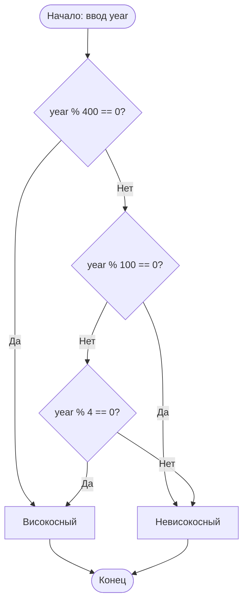

# Алгоритм определения високосного года

## Правило

Год **високосный**, если:
- он делится на 400 без остатка, **или**
- он делится на 4 без остатка **и** не делится на 100 без остатка.

## Блок-схема



## Краткая формула (для задания 3)

```
високосный  ⟺  (year % 4 == 0  и  year % 100 != 0)  или  (year % 400 == 0)
```

## Примеры

| Год  | Делится на 4 | на 100 | на 400 | Результат      |
|------|--------------|--------|--------|----------------|
| 2024 | да           | нет    | нет    | високосный     |
| 1900 | да           | да     | нет    | невисокосный   |
| 2000 | да           | да     | да     | високосный     |
| 2025 | нет          | —      | —      | невисокосный   |
